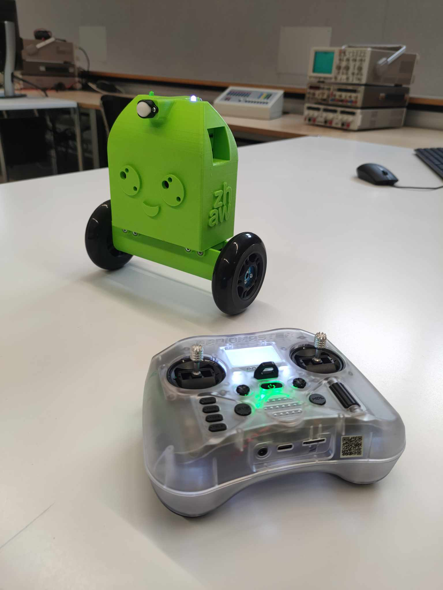
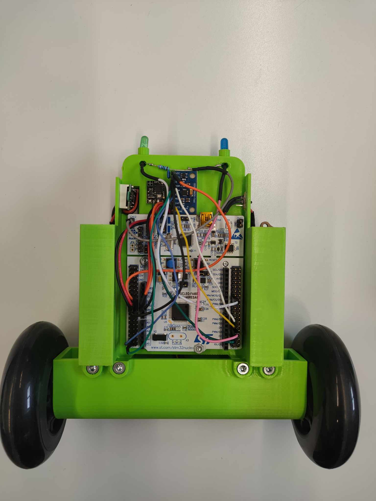
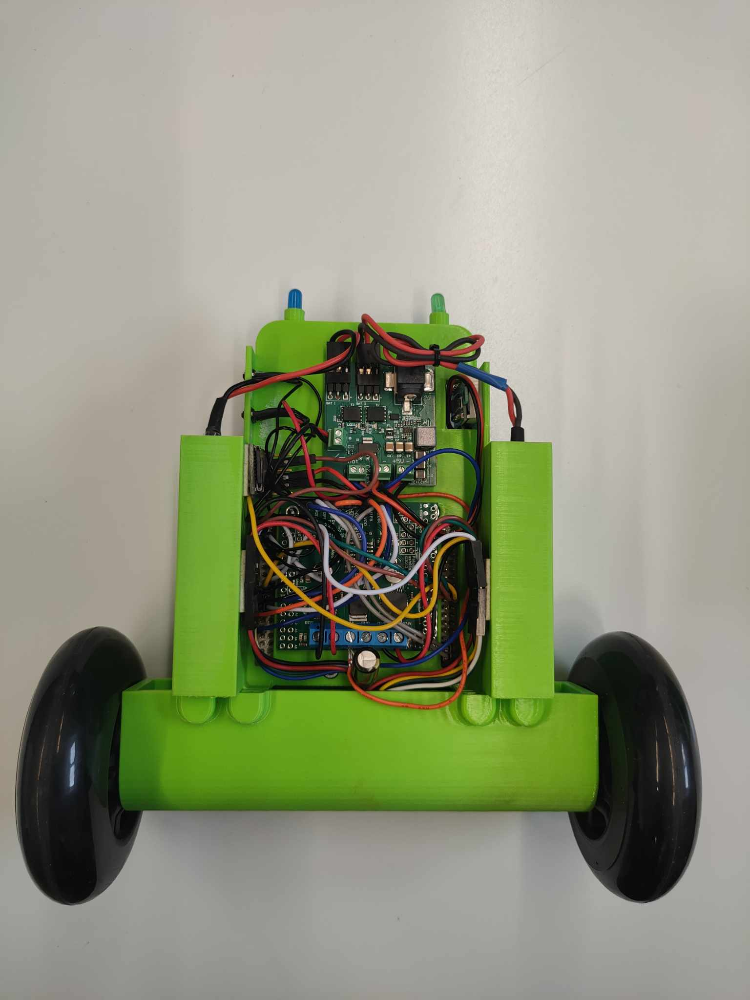
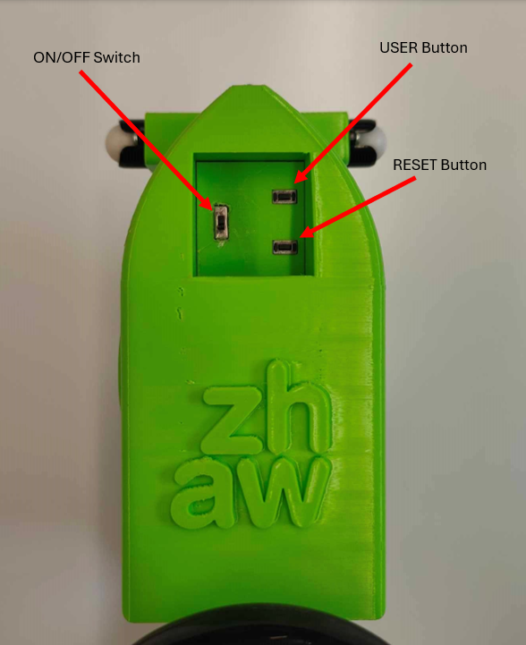

# MiniSegway

The Segway is a robot that has the ability to balance itself using two motors and an IMU sensor. It is controlled with a radio transmitter in two modes, a car where it moves on the ground maintaining three points of support but also as a segway, that is, balancing on two wheels. 

<p align="center">
     </br>
    <i>Segway with radio</i>
</p>

## Table of Contents

1. [Repository structure](#repository-structure)
2. [Hardware](#hardware)
3. [Prerequisites](#prerequisites)
4. [User manual](#user-manual)
5. [Software](#software)
6. [Notes](#notes)

## Repository structure

- ``/docs/cad`` - cad files with division into different extensions, including print-ready STL files and STEP files. <br>
- ``/docs/hardware`` - folder contains all hardware's datasheets and list <br>
- ``/docs/matlab`` - folder contains all development files in matlab <br>
- ``/docs/papers`` - folder contains all scientific papers regarding segway development 

## Hardware

Mechanical components (ordered) employed in design: 

- [Scooter/Skate Wheel 84×24mm][12] <br>
- [Pololu Aluminum Scooter Wheel Adapter for 4mm Shaft][13] <br>
- 2 x [Pololu Ball Caster with 1/2″ Plastic Ball][17] 

All frame parts 3D models are localized in ``docs/cad/`` folder

The list of eletric components varies from version to version, as a special PCB has been designed to eliminate some of the components and allow the battery to be charged directly on the robot. In the absence of a PCB, a list of stock components is provided.

**VERSION WITHOUT PCB**

Electrical components and sensors:

- [Nucleo-F446RE][1] <br> 
- [Pololu Dual MC33926 Motor Driver Shield for Arduino][2] <br>
- 2 x [47:1 Metal Gearmotor 25Dx67L mm MP 12V with 48 CPR Encoder][3] <br>
- [MPU6500 - 6DOF IMU][4] <br>
- [OpenLager Blackbox][5] <br>
- [RadioMaster RP2 ELRS 2.4GHz Nano Receiver][6] <br>
- [0,28" Mini Digital-Voltmeter mit LED Anzeige, 3,2-30V, 2-Wire, red][7] <br>
- [Pololu mini push-button switch][8] <br>
- 3 x [Mini Pushbutton Switch: PCB-Mount][9] <br>
- 2 x [Conrad energy NiMH battery packs 6V, 2300mAh][10] <br>
- [RadioMaster Pocket Radio Controller (ELRS)][11]<br>
- [Micro BEC 7-21V to 5V/12V-ADJ][15] <br>
- [Charger model 220v 0.5a 1a volcraft mw6168v][16] <br>
- 2 x LED diode <br>
- Jumper wires

The electronics connection is included in the file, which can be found [HERE](/docs/hardware/Segway_connection_diagram_F446RE.pdf)

**VERSION WITH PCB**

- [Nucleo-F446RE][1] <br> 
- [Pololu Dual MC33926 Motor Driver Shield for Arduino][2] <br>
- 2 x [47:1 Metal Gearmotor 25Dx67L mm MP 12V with 48 CPR Encoder][3] <br>
- [MPU6500 - 6DOF IMU][4] <br>
- [OpenLager Blackbox][5] <br>
- [RadioMaster RP2 ELRS 2.4GHz Nano Receiver][6] <br>
- [0,28" Mini Digital-Voltmeter mit LED Anzeige, 3,2-30V, 2-Wire, red][7] <br>
- [Mini Slide Switch: 3-Pin, SPDT, 0.3A][14] <br>
- 2 x [Mini Pushbutton Switch: PCB-Mount][9] <br>
- 2 x [Conrad energy NiMH battery packs 6V, 2300mAh][10] <br>
- [RadioMaster Pocket Radio Controller (ELRS)][11]<br>
- [Charger model 220v 0.5a 1a volcraft mw6168v][16] <br>
- Custom PCB
- 2 x LED diode <br>
- Jumper wires

The electronics connection is included in the file, which can be found [HERE](/docs/hardware/Segway_connection_diagram_F446RE_with_PCB.pdf) <br>
All the files related to PCB can be found in ``docs/segway_charging_board/``

Below there is components placement shown:

<p align="center">
     </br>
    <i>Front</i>
</p>

<p align="center">
     </br>
    <i>Back</i>
</p>

## Prerequisites

- Mbed Studio
- Libraries:
    - mbed-os 6.17.0
    - eigen

All the libraries you need are included in the repository. Software is mostly based on files located in /src folder and main logic is included in MiniSegway class that is running in own thread.

## User manual

### Running the project for the first time

In order to run the project you need to import program to Mbed Studio and follow next steps:
- as the board is using external power source, board has jumper JP5 switched to E5V postion which requires to first supply board with external power and then plug it in to the computer
- now program can be compiled and flashed to the board

### Using robot

In order to use the robot you must follow the steps below:
- Start the radio controller that is paired with the receiver on the robot
- Turn on the power supply on the robot (in this situation both LED, green and blue will start blinking)
- Arm the radio controler (SD button) (in such case the green LED will start to shine continuously)
- Then the USER button on the robot can be pressed, which will lead the robot to CAR mode (blue LED will start to shine continuously) [picture below]
- To use the robot as segway, raise it to a standing position and wait until the robot visibly starts to balance.
- By default, the robot is in normal mode, however, when you press the button on the radio transmitter (SA button), the robot will go into fast mode, and its speed will be increased (**NOTES: In normal mode, the robot is practically unturnable when controlling the radio transmitter (as long as there is no collision, of course), however, in fast mode there is the possibility of such control, which will lead to loss of balance.**)

<p align="center">
     </br>
    <i>Button layout</i>
</p>

## Software

### main.cpp

The *main.cpp* file contains only the declaration of the rc class, which handles communication with the radio transmitter, and the minisegway, which contains all the program logic. Inside the file you can also find the declaration of an additional button that serves as the RESET of the system.

### config.h

The *config.h* file is very important due to the fact that it contains all the declarations of the robot's parameters and the names of the pins used to connect the hardware. Importantly, it also contains options for changing the robot's configuration, i.e. enabling or disabling certain options such as data transfer (over the link or to an SD card), measurements with additional current sensors, or a function for testing the frequency response with a chirp signal. 
This file should be used for all configurations related to changing the parameters of the robot, changing the parameters of the filters and any changes to the pin maps.

### minisegway.cpp

Minisegway is a class that operates in its own thread with a frequency of 1kHz. In it there are declarations of all objects communicating with the hardware that is mounted on the robot. Inside the class you can find the state machine, because as mentioned the robot moves in two modes, as a car or as a segway. The file also includes additional functions, used during debugging and testing of the hardware operation.

#### IMU

The IMU class is initialized when the MiniSegway class is initialized, the first step that is performed inside the IMU is to configure and check the connection which is signaled by returning the device ID to the output window.The device is then calibrated, with the first thousand measurement points omitted due to the fact that they deviate significantly from the norm and there are fluctuations associated with the initialization process.

In addition, position mapping is performed due to the target position of the robot and the positioning of the IMU on the robot:

1. **Roll Control Advantage**: The alignment allows the use of roll for controlling the Segway. Roll control is preferred because yaw control can encounter singularities (undefined or unstable behavior) at angles of ±90 degrees when the Segway is upright.

2. **IMU Orientation**:
   - **X-Axis**: The IMU's x-axis is oriented to point to the left side of the Segway.
   - **Y-Axis**: The IMU's y-axis is oriented to point towards the back of the Segway.
   - **Z-Axis**: The IMU's z-axis is oriented to point upwards.

In case of completion of the calibration process, a flag is sent confirming the completion of the process so that further execution of the program in the minisegway class can be executed.

#### State space controller

This state-space controller is designed to keep a Segway in a vertical position by controlling the robot's velocity input based on various sensor readings and setpoints. The control strategy involves multiple proportional (P) and derivative (D) components applied to different states of the system:

1. **Position Control ( u_p_{pos} )**:
   - **Proportional Control on Position**: 
     - `robotVelSetpointIntegrator.apply(robot_vel_setpoint(0))` is the integrated velocity setpoint, which essentially gives the desired position setpoint.
     - `robot_pos(0)` is the current position of the Segway.
     - `MINI_SEGWAY_CP_POS_KP` is the proportional gain for position control.
     - The difference between the desired position setpoint and the current position is multiplied by the proportional gain to produce the position control effort `u_p_pos`.

2. **Velocity Control (u_p_{vel}  and u_d_{vel})**:
   - **Proportional Control on Velocity**:
     - `robot_vel(0)` is the current velocity of the Segway.
     - `MINI_SEGWAY_CPD_VEL_KP` is the proportional gain for velocity control.
     - The current velocity is multiplied by the proportional gain to produce the velocity control effort `u_p_vel`.
   - **Derivative Control on Velocity**:
     - `acc_x_filtered` is the filtered acceleration along the x-axis.
     - `MINI_SEGWAY_CPD_VEL_KD` is the derivative gain for velocity control.
     - The filtered acceleration is multiplied by the derivative gain to produce the velocity derivative control effort `u_d_vel`.

3. **Angle Control (u_p_{ang} and u_d_{ang})**:
   - **Proportional Control on Angle**:
     - `imu_data.rpy(0)` is the roll (angle) of the Segway as measured by the IMU (Inertial Measurement Unit).
     - `MINI_SEGWAY_CPD_ANG_KP` is the proportional gain for angle control.
     - The roll angle is multiplied by the proportional gain to produce the angle control effort `u_p_ang`.
   - **Derivative Control on Angle**:
     - `gyro_theta_filtered` is the filtered angular velocity (rate of change of angle).
     - `MINI_SEGWAY_CPD_ANG_KD` is the derivative gain for angle control.
     - The filtered angular velocity is multiplied by the derivative gain to produce the angle derivative control effort `u_d_ang`.

4. **Combining Control Efforts**:
   - The control efforts from the position, velocity, and angle controllers are combined to produce the total control input.
   - The equation `robot_vel_input(0) = -1.0f * (u_p_pos - (u_p_vel + u_d_vel + u_p_ang + u_d_ang))` combines these efforts. The negative sign indicates that the control input is used to counteract deviations from the desired state, aiming to keep the Segway upright.


## Notes:

In the event that a version of Segway will be assembled that does not have a custom PCB, the arrangement of additional hardware will cause the IMU to be on the other side of the robot. In this case, changes must be made to the software in order for the robot to function properly. In the 45th line of **IMU.cpp** file located in ``src`` folder, is following code, that is working only with the version with custom PCB:

```
    // segway imu alignment:
    // the alignment was chosen so that roll can be used for controlling
    // the segway since yaw has a singularity at +/-90 deg
    //   when standing upright, the IMU is mounted on the robot with:
    //   - the x-axis pointing to the right
    //   - the y-axis pointing forwards
    //   - the z-axis pointing upwards
    Eigen::Vector3f gyro(m_ImuMPU6500.gyroX, -m_ImuMPU6500.gyroZ, m_ImuMPU6500.gyroY);
    Eigen::Vector3f acc(m_ImuMPU6500.accX, -m_ImuMPU6500.accZ, m_ImuMPU6500.accY);
```

To match the code to a different orientation of the IMU, i.e., located on the other side of the robot, you need to change the characters of the data coming from each axis as shown in the illustration below.

```
    // segway imu alignment:
    // the alignment was chosen so that roll can be used for controlling
    // the segway since yaw has a singularity at +/-90 deg
    //   when standing upright, the IMU is mounted on the robot with:
    //   - the x-axis pointing to the left
    //   - the y-axis pointing backwards
    //   - the z-axis pointing upwards
    Eigen::Vector3f gyro(-m_ImuMPU6500.gyroX, m_ImuMPU6500.gyroZ, m_ImuMPU6500.gyroY);
    Eigen::Vector3f acc(-m_ImuMPU6500.accX, m_ImuMPU6500.accZ, m_ImuMPU6500.accY);
```

[1]: https://os.mbed.com/platforms/ST-Nucleo-F446RE/
[2]: https://www.play-zone.ch/en/pololu-dual-mc33926-motor-driver-shield-for-arduino.html
[3]: https://www.pololu.com/product/4865
[4]: https://www.smart-prototyping.com/MPU6500-6DOF-Sensor-Breakout-Board
[5]: https://www.racedayquads.com/products/airbot-openlager-blackbox
[6]: https://fpvracing.ch/de/funksystem/3575-radiomaster-rp2-elrs-24ghz-nano-receiver.html?
[7]: https://www.berrybase.ch/0-28-mini-digital-voltmeter-mit-led-anzeige-3-2-30v-2-wire-rot
[8]: https://www.pololu.com/product/2808
[9]: https://www.pololu.com/product/1400
[10]: https://www.conrad.ch/de/p/reely-modellbau-akkupack-nimh-6-v-2300-mah-zellen-zahl-5-mignon-aa-side-by-side-jr-buchse-2613252.html
[11]: https://fpvracing.ch/de/funksystem/3785-radiomaster-pocket-radio-controller-elrs.html?
[12]: https://www.pololu.com/product/3275
[14]: https://www.pololu.com/product/1408
[13]: https://www.pololu.com/product/2672
[15]: https://www.mateksys.com/?portfolio=mbec2a#tab-id-2
[16]: https://eclats-antivols.fr/en/ean/24811-chargeur-de-modelisme-220-v-1-a-voltcraft-mw6168v-nicd-nimh-4016138642414.html
[17]: https://www.pololu.com/product/952
